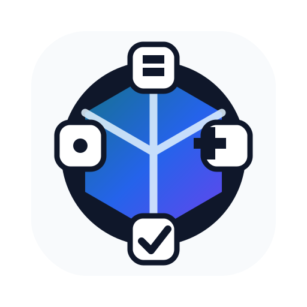
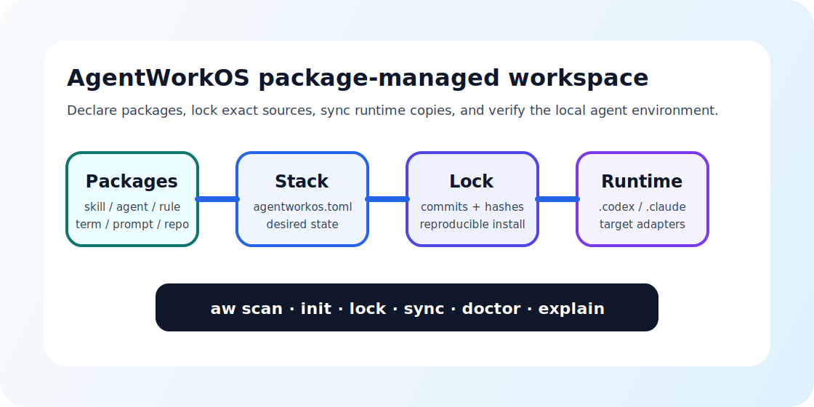

<div align="center">
  
  <h1>AgentWorkOS</h1>
  <p><strong>Package-managed operating layer for AI agent workspaces.</strong></p>
  <p>
    <a href="./docs/specs/agentworkos-toml.md">Stack Spec</a>
    ·
    <a href="./docs/specs/agentpkg-toml.md">Package Spec</a>
    ·
    <a href="./schemas">Schemas</a>
    ·
    <a href="./examples/harzva-default">Example Stack</a>
    ·
    <a href="./skills/agentworkos-inventory/SKILL.md">Inventory Skill</a>
  </p>
  <p>
    
    
    
    
  </p>
</div>

<p align="center">
  
</p>

## What It Is

`AgentWorkOS` is a package manager and standard for AI agent context.

It treats agent workspaces the way modern developer tooling treats code environments:

- `agentworkos.toml` declares the desired agent workspace.
- `agentworkos.lock.json` pins exact package sources, commits, and hashes.
- `awos scan` inventories the local runtime.
- `awos sync` installs local packages into runtime paths, dry-run by default.
- `awos doctor` catches drift before a context move breaks.
- `awos explain` expands shorthand terms such as `三端同步`.

The point is simple: your Skills, Agent roles, Rules, Terms, Prompts, MCP configs, Hooks, and repo references should be installable, auditable, and portable across machines.

## Quick Start

```powershell
python -m pip install -e .
awos init --root .
awos scan --codex-home "$env:USERPROFILE\.codex" --workspace .
awos lock --offline
awos doctor
awos sync
```

`sync` is dry-run by default. Use `--apply` only when the plan is correct:

```powershell
awos sync --apply
```

## Core Concepts

| Concept | File | Similar idea |
| --- | --- | --- |
| Stack | `agentworkos.toml` | `environment.yml`, `requirements.txt`, `pyproject.toml` |
| Lockfile | `agentworkos.lock.json` | `uv.lock`, `flake.lock` |
| Package | `agentpkg.toml` | package metadata |
| Runtime | `.codex/skills`, `.codex/agents`, local repos | installed environment |
| Doctor | `awos doctor` | environment health check |
| Term map | `TERMS.md` | shorthand expansion table |

## Commands

| Command | Purpose |
| --- | --- |
| `awos init` | Create a sample stack manifest and term map |
| `awos scan` | Inventory local skills, agents, terms, and repos |
| `awos lock` | Generate `agentworkos.lock.json` from the manifest |
| `awos sync` | Dry-run package installation into runtime paths |
| `awos sync --apply` | Apply local package sync |
| `awos doctor` | Check manifest health and common drift |
| `awos explain 三端同步` | Expand a shorthand term from `TERMS.md` |

## Package Types

| Type | Meaning | Install target |
| --- | --- | --- |
| `skill` | A `SKILL.md` capability package plus supporting files | `.codex/skills/<name>` |
| `agent` | A role card or local agent definition | `.codex/agents/roles/<name>.md` |
| `rule` | AGENTS.md snippet or hard operating rule | project or global agent rules |
| `terms` | Shorthand glossary | `.codex/agents/TERMS.md` |
| `prompt` | Reusable prompt template | prompt library |
| `sop` | Standard operating procedure | SOP library |
| `hook` | Lifecycle check or future automation contract | hook runtime |
| `mcp` | MCP/tool config description | MCP config docs or runtime |
| `repo` | A useful source repository checkout | workspace repo path |

## Design Inspirations

AgentWorkOS borrows proven package-management ideas rather than inventing mystery machinery:

- `uv` has one fast CLI for projects, lock, sync, tools, and Python environments.
- `conda` uses an environment file to exchange complete environments.
- `pip` requirements files show the value of plain dependency declarations.
- Nix flakes show how declared inputs and lockfiles make environments reproducible.

See [`docs/inspirations.md`](./docs/inspirations.md) for source links and what AgentWorkOS adopts.

## Repository Layout

```text
AgentWorkOS/
├─ src/agentworkos/       # awos CLI implementation
├─ schemas/               # JSON schemas for stack, lock, and packages
├─ docs/specs/            # human-readable specs
├─ examples/              # sample AgentWorkOS stack
├─ skills/                # installable AgentWorkOS skills
├─ scripts/               # bootstrap helpers
└─ tests/                 # CLI and parser tests
```

## Roadmap

| Stage | Target |
| --- | --- |
| v0.1 | Scan, init, lock, doctor, dry-run sync, explain terms |
| v0.2 | Remote git package cache and locked install |
| v0.3 | `agentpkg.toml` validation and package publish checklist |
| v0.4 | Three-end sync verifier for runtime, source repo, and remote |
| v0.5 | Hook runner and GitHub Action |
| v1.0 | Stable AgentWorkOS Package Spec |

## Safety

- No destructive sync by default.
- No secret collection.
- No raw private chat log packaging.
- Local paths belong in `agentworkos.local.toml`, not public stack manifests.
- Public packages should include specs, schemas, docs, tests, and release proof.

## License

MIT
