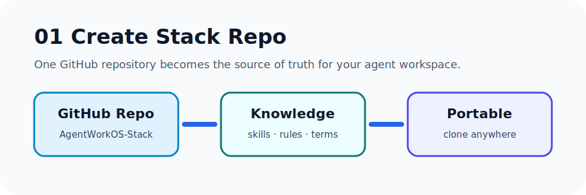
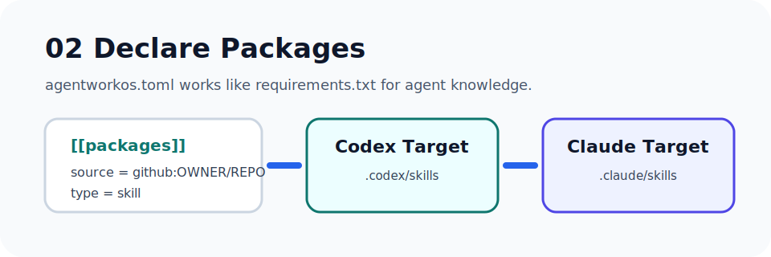
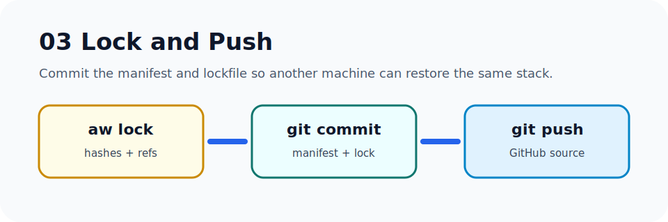
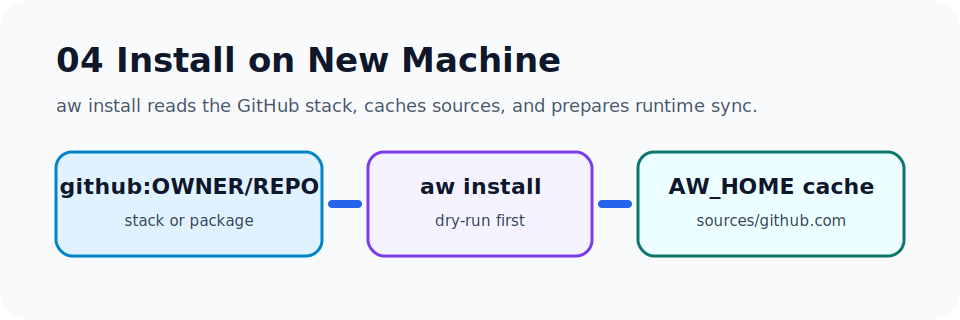
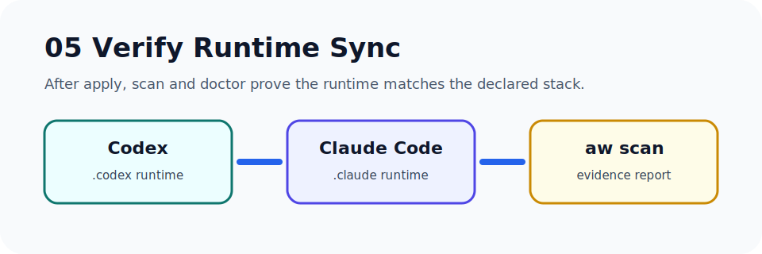

# 快速上手

这页按“干活教程”的方式走完整流程：从 GitHub 建一个 Stack Repo，到新电脑一条命令恢复 Codex / Claude Code 工作环境。

## 1. 创建 Stack Repo



新建一个 GitHub 仓库，例如：

```text
AgentWorkOS-Stack
```

它是你的个人 agent 工作环境入口，建议保存：

- `agentworkos.toml`
- `agentworkos.lock.json`
- `TERMS.md`
- 可公开的 Rules、Prompts、Skills 索引
- 常用知识包和工具仓库引用

不要提交 token、cookie、私有聊天原文或本机绝对路径。

## 2. 声明知识包



在 Stack Repo 里写 `agentworkos.toml`：

```toml
[stack]
name = "my-agentworkos"
version = "0.1.0"
codex_home = "~/.codex"
claude_home = "~/.claude"

[[packages]]
id = "io.github.example.readme-design"
type = "skill"
source = "github:example/readme-design"
path = "skills/readme-design"
install_to = "skills/readme-design"
ref = "main"

[[packages.targets]]
runtime = "codex"
install_to = "skills/readme-design"

[[packages.targets]]
runtime = "claude-code"
install_to = "skills/readme-design"
adapter = "skill-to-claude-skill"
```

这里的 `source` 可以是：

- `github:OWNER/REPO`
- `https://github.com/OWNER/REPO`
- `git+https://github.com/OWNER/REPO.git`

## 3. lock 并推到 GitHub



在 Stack Repo 内执行：

```powershell
aw lock --offline
aw doctor
git add agentworkos.toml agentworkos.lock.json TERMS.md
git commit -m "Update AgentWorkOS stack"
git push
```

`agentworkos.lock.json` 记录 resolved source、commit、hash 和 target 信息。它让新电脑恢复时不只知道“要装什么”，也知道“当时锁住的是什么”。

## 4. 新电脑安装



新电脑先装 AgentWorkOS，然后从 GitHub Stack Repo 安装：

```powershell
python -m pip install -e .
aw install github:OWNER/AgentWorkOS-Stack --target all
```

检查 dry-run 输出，确认会写入的位置正确：

```text
would clone ...
detected stack repo ...
would copy ... -> ~/.codex/skills/...
would copy ... -> ~/.claude/skills/...
```

确认无误后执行：

```powershell
aw install github:OWNER/AgentWorkOS-Stack --target all --apply
```

## 5. 验证 runtime



安装完成后跑：

```powershell
aw doctor
aw scan --workspace .
aw sync --target codex
aw sync --target claude-code
```

验收标准：

- Codex runtime 有目标 Skills / Agents / Terms。
- Claude Code runtime 有对应 Skills / Agents / Commands / Terms。
- 本地 Stack Repo 与远程 GitHub Repo 已同步。
- `aw sync` dry-run 不再出现意外写入路径。

## 安全默认

`aw install` 和 `aw sync` 都默认 dry-run。只有加上 `--apply` 才会写入：

- `~/.agentworkos/sources/...` 远程缓存
- `~/.codex/...`
- `~/.claude/...`
